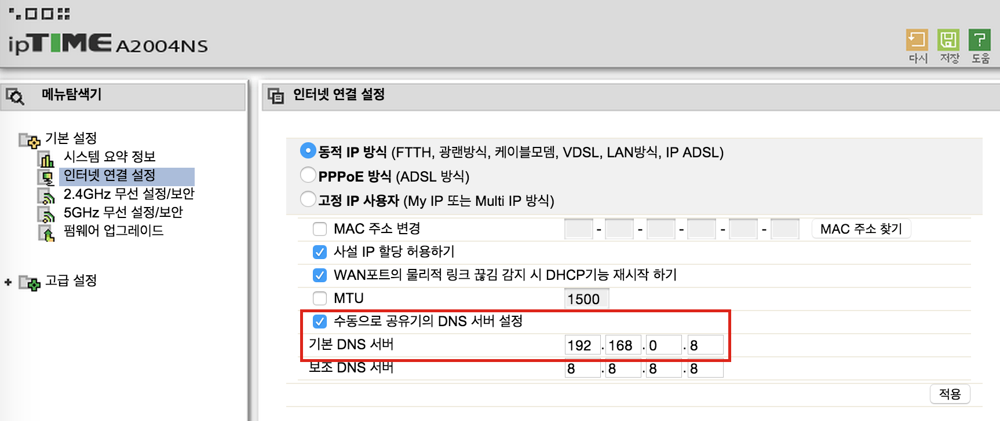

# ADBlock DNS
create own adblock dns using rasberrypi and dnsmasq

## Basics
Advertisements are usually located on ad.download.cnet.com or similar addresses. This program create DNS that maps these addresses to 127.0.0.1.

## How to use
1. Install dnsmasq on rasberrypi.
```
raspberrypi ~ $ sudo apt-get install dnsmasq
```

2. Clone this project on rasberrypi.
```
raspberrypi ~ $ git clone https://github.com/shuggiejang/adblock_dns.git
```

3. Get adblock filters and custom custom_ad_domains.
```
raspberrypi ~ $ cd adblock_dns/
raspberrypi ~/adblock_dns $ ./update_adblock_filter.sh
raspberrypi ~/adblock_dns $ vi custom_ad_domains.txt
```

4. Run the following command.
```
raspberrypi ~/adblock_dns $ ./update_dns.sh
```

5. Update DNS on your router(once needed).
```
raspberrypi ~ $ ifconfig eth0
eth0      Link encap:Ethernet  HWaddr b8:27:eb:72:9a:d3
          inet addr:192.168.0.8  Bcast:192.168.0.255  Mask:255.255.255.0
...
```


## Details
1. Remove duplicates and create DNS configuration.
2. Remove subdomains if a higher domain exists.
```
# ad-domains
raspberrypi ~/adblock_dns $ grep -Hrn realclick ./*.txt
./ad_punisher_abp.txt:382:||realclick.co.kr
./custom_ad_domains.txt:74:realclick.co.kr
./custom_ad_domains.txt:112:click.realclick.co.kr
./custom_ad_domains.txt:113:ads.realclick.co.kr
./custom_ad_domains.txt:114:ptimg.realclick.co.kr
./custom_ad_domains.txt:115:rsense-ad.realclick.co.kr
./custom_ad_domains.txt:116:ade.realclick.co.kr
./custom_ad_domains.txt:117:img.realclick.co.kr
./custom_ad_domains.txt:118:adr.realclick.co.kr
./custom_ad_domains.txt:119:hcimg.realclick.co.kr
./custom_ad_domains.txt:120:image3.realclick.co.kr
./custom_ad_domains.txt:121:image13.realclick.co.kr
./custom_ad_domains.txt:122:mdimg.realclick.co.kr
./custom_ad_domains.txt:123:ptimg.realclick.co.kr
./custom_ad_domains.txt:124:scimg.realclick.co.kr
./easylist.txt:24887:||realclick.co.kr^$third-party

# DNS configuration
raspberrypi ~/adblock_dns $ grep -Hrn realclick ./*.conf
./dnsmasq.adlist.conf:3769:address=/.realclick.co.kr/127.0.0.1 #realclick
```
